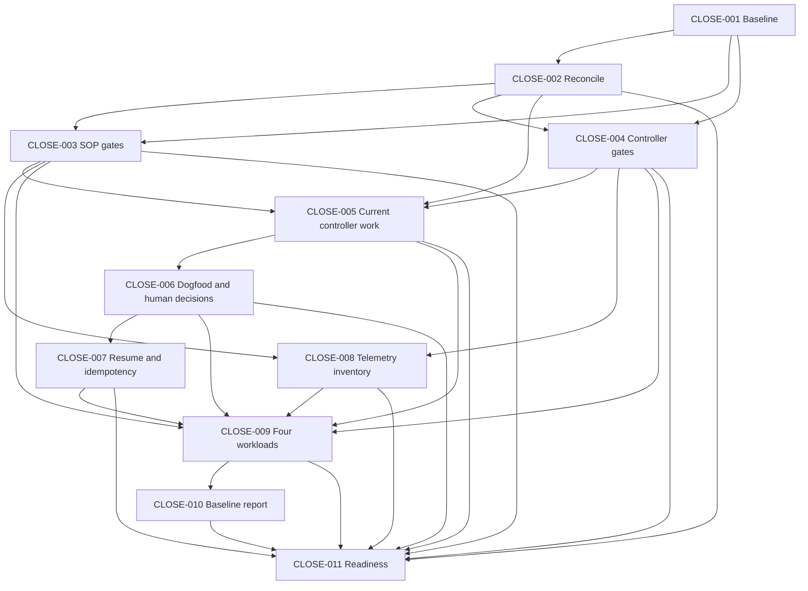

# Pre-Performance Closure and Baseline

**Status:** COMPLETE — executed; all eleven `CLOSE` tasks are `LOCAL_DONE` and each
stage gate passed. The readiness verdict and the two explicit deferrals are recorded in
`docs/reports/pre-performance-closure/CLOSE-011-readiness.md`.

## Project

agentic-sop

## Summary

Pre-performance closure, reconciliation, verification and measurement plan (named plan). It closes out and reconciles the agentic-sop and sop-controller work preceding any performance architecture, then captures a truthful, reproducible pre-performance baseline with a frozen four-workload fixture matrix (A/B/C/D) at THREE real-provider repetitions each.

Planning provenance (2026-10-02): generated through SOP's read-only PLAN capability,
with final typed output at
`.agent-sdlc/runs/prompts/prompt-20261002-131045/result.md` and scope framing from
`prompt-20261002-130509`. The planning invocation performed no implementation,
repository validation, branch change, task/approval/reconcile mutation, commit or
push. The reviewed named plan is saved at
`docs/plans/PLAN-Pre-Performance-Closure.md`; raw SOP run evidence stays under
`.agent-sdlc/`. Its eleven stages compile deterministically. Creation of this
document does not execute its validation gates or capture a performance baseline.

## Capabilities

### SOP CLI command surface — EXISTS

- Evidence: sop version, sop providers --models, sop status, sop task <id>, sop resume, sop approvals --json, sop approval <id>, sop reconcile <PLAN.md> --list-changed --json, sop report, sop prompt --capability plan|review --file --json are documented in docs/reference/CLI.md (read at docs/reference/CLI.md); sop models and sop provider list do NOT exist and must never be used.

### SOP plan status/backlog/known-limitations surfaces — EXISTS

- Evidence: docs/plans/BACKLOG.md and docs/reference/PROJECT-STATUS.md exist (listed under docs/plans and docs/reference at planning time).

### SOP named-plan resolution/identity/fingerprint/bootstrap/DAG — EXISTS

- Evidence: docs/plans/PLAN-Phase-3.5-Model-Routing.md exists with a Task list, Dependency Graph and validation section (read during planning); recorded active plan provenance at planning time was plan_id plan-phase-3-5-model-routing, source_sha256 32f6f783c07d5b74ff80e378f529a6e0f96bdd7d950a0d9f3e1531d32f36a518 in .agent-sdlc/plan.meta.json.

### SOP human approval gate (list/decide/reconcile) — EXISTS

- Evidence: Phase 6 implemented per docs/README.md (P6-001–P6-011) and documented in docs/guides/APPROVALS.md.

### SOP deterministic validation/review lifecycle and verify-first — EXISTS

- Evidence: docs/reference/PERFORMANCE.md (read during planning) documents runStages in internal/cli/run.go, verify-first agent-call avoidance, and validation/review reuse identity rules in internal/cli/session.go.

### SOP performance telemetry (stages_ms, validation_ms, total_ms, counts) — EXISTS

- Evidence: docs/reference/PERFORMANCE.md (read) records internal/perf as the single representation with stages_ms, validation_ms, total_ms, CategoryMS, WriteTask/WriteRun; per-task .agent-sdlc/runs/<task-id>/metrics.json, the performance field in report.json, and the plan aggregate .agent-sdlc/runs/<plan-id>/metrics.json.

### Safe intra-run validation/review reuse — EXISTS

- Evidence: docs/reference/PERFORMANCE.md (read) states identity is hashed on command set+diff for validation and task+diff+engine for review; only passing/clean results are cached; internal/cli/session.go holds the rules.

### Controller performance projections — EXISTS

- Evidence: internal/sopclient/performance.go and task/project performance templates read the existing per-task/plan metrics contract; extension of the contract is deferred.

### Controller current named plan — EXISTS

- Evidence: docs/PLAN-SOP-Controller.md with recorded provenance plan_id plan-sop-controller, source_sha256 42f48315b3d567813eefb8b635a76fc80f4b068276b92d90b4a37fadc2ce36f1. This master plan imports it as evidence and does not replace it.

### Controller boundary/human-approval/observability/performance code — PARTIAL

- Owner: controller
- Evidence: Present per the task specification; exact pass/fail is UNKNOWN until CLOSE-004 runs.
- Gap: Deterministic pass/fail and boundary ownership verified only by the CLOSE-004 run.
- Resolution: CLOSE-004 runs the controller gates and boundary tests and records the result.

### Agentic-sop deterministic baseline green — PARTIAL

- Owner: SOP
- Evidence: Prior go test ./... had 12 CLI/JEV no-change expectation failures reproduced on untouched d0af5a4; resolution (stale tests vs behavior defect) is a CLOSE-003 deliverable.
- Gap: The deterministic gates are not yet recorded green.
- Resolution: CLOSE-003 runs all five Go checks and CI checks and resolves the twelve failures with bounded closure remediation.

### Aligned reproducible sop binary — PARTIAL

- Owner: SOP
- Evidence: Installed sop reports sop dev with vcs.revision d0af5a475e1be7a89c58571923cdc02896e15990 and vcs.modified=true while tracked HEAD is 1ce9bdb5d5d959fe87b315a5aca5e8cbaab8998f.
- Gap: No known reproducible build aligned to the recorded baseline; binary hash snapshot will be repinned after legitimate closure remediation.
- Resolution: CLOSE-001 records the mismatch and CLOSE-005 rebuilds/re-pins the exact SOP binary before dogfood/measurement; no binary is installed or swapped during this planning invocation.

### Controller named-plan dogfood in its own checkout — PARTIAL

- Owner: controller
- Evidence: scripts/c2-009-dogfood.sh exists per the task specification and docs/PLAN-SOP-Controller.md exists; C2-009 records a historical real-binary dogfood as NOT READY.
- Gap: No fresh end-to-end named-plan dogfood with human-decision observation has been run in the current checkout.
- Resolution: CLOSE-006 performs a fresh real run, including the controller HUMAN flow via scripts/c2-009-dogfood.sh in a disposable project; the old result must not be relabeled PASS.

### Pending CTRL006 approval — EXISTS

- Evidence: sop approvals --json records CTRL006 PENDING NEEDS_HUMAN, requested 2026-10-01T03:52:02Z, tied to an older no-change diagnostic. It is not proof of a current human action nor permission to auto-approve; CLOSE-005/006 must treat it as evidence and observe real gates.

### Controller CTRL001–CTRL017 status — EXISTS

- Evidence: sop resume reports nothing to resume and the recorded status is PLANNED. Recorded status must be distinguished from actual implementation in CLOSE-002/005.

### Cross-root mutation (one repository's native harness mutating its sibling) — MISSING

- Owner: operator/SOP process boundary
- Evidence: No single repository's native harness is able to mutate its sibling; this is not permitted.
- Gap: Cross-root mutation is not available; the CLOSE-009 fixture commands must execute on independent disposable fixture projects in correct roots, not from the master native harness against a sibling.
- Resolution: Controller-local work and commands run within its own checkout via SOP/current named plan or operator execution; CLOSE-006 uses disposable controlled projects for destructive/manual/denial scenarios; CLOSE-009 runs each workload in its own disposable fixture clone.

### Future telemetry fields (prompt compilation, context construction, cache lookup, indexing, RAG retrieval, tokens, tool execution, normalization, retry/escalation, selected model/class) — MISSING

- Owner: SOP (future phase)
- Evidence: Not present in the current internal/perf contract (docs/reference/PERFORMANCE.md read at planning time records only stage durations, operation counts, CategoryMS, WriteTask/WriteRun); classified in CLOSE-008.
- Gap: These data points are not yet available in the authoritative telemetry; exact model-call counts/LLM time cannot be proven from stage-level agent durations.
- Resolution: CLOSE-008 records them as AVAILABLE/PARTIAL/MISSING/NOT APPLICABLE with evidence; values that cannot be proven are marked UNAVAILABLE; no value is inferred and no new instrumentation is built here.

### New performance architecture (Prompt Compiler, Response Normalizer, Context Engine, caches, index, RAG, Decision Memory, Adaptive Routing, Automatic Prompt Tuning, network/team mode, small-device dashboard, Jev adapter/evaluation, task-scoped discovery budget implementation, Windows enhancements) — MISSING

- Owner: future phase
- Evidence: Explicitly deferred scope; docs/plans/PLAN-Phase-3.5-Model-Routing.md lists dynamic cost optimization, automatic provider switching, benchmark-driven model selection, learned/LLM-controlled routing, remote SOP Hub, MCP orchestration, distributed execution and automatic downgrade/escalation loops as out of scope.
- Gap: Not implemented and not to be reimplemented or started in this closure plan.
- Resolution: Recorded as deferred scope; no stage in this plan implements any of it.

## Assumptions

### Both repositories are the observed roots: agentic-sop at the current checkout (branch fix/verify-repository-mutations, HEAD 1ce9bdb5d5d959fe87b315a5aca5e8cbaab8998f, local main d46bc1674e6f25e6c57219b0e49e0853a94f40e5) and sop-controller (main, HEAD fde492ddbea4d3a23aa2f20d097de35eae8ec1f6). Branch 1ce9bdb and controller fde492d are starting facts, not everlasting SHAs after authorized closure edits.

- Evidence: git status --short --branch on the current checkout reports branch fix/verify-repository-mutations; the SHAs are observed-but-unverified.
- Consequence: CLOSE-001 re-verifies both roots, branches, HEADs and dirty state before any later work depends on them, and repins source SHA/binary hash after legitimate bounded closure remediation.

### Go go1.27.1 darwin/arm64 is the toolchain for both baselines.

- Evidence: Observed locally at planning time.
- Consequence: CLOSE-001 records the toolchain and CLOSE-003/CLOSE-004 record it with every gate command.

### The controller's recorded docs/PLAN-SOP-Controller.md remains authoritative unless CLOSE-002 evidence shows otherwise; the located historical wrap-up plan docs/history/PLAN-wrapup.md is used only when provenance makes it appropriate.

- Evidence: Recorded fingerprint plan_id plan-sop-controller, source_sha256 42f48315b3d567813eefb8b635a76fc80f4b068276b92d90b4a37fadc2ce36f1.
- Consequence: CLOSE-006 resolves the authoritative named plan from CLOSE-002 evidence before running.

### Existing internal/perf is the single authoritative metrics representation to extend later; this plan introduces no new performance architecture or telemetry subsystem; bounded closure correctness fixes remain permitted. Authoritative stage agent_calls are distinct from individual provider/model generation calls, and existing stage durations include orchestration/tool overhead so they are not exact LLM time.

- Evidence: docs/reference/PERFORMANCE.md (read) records internal/perf, stage durations from the monotonic clock wrapping existing operations, and operation counts.
- Consequence: CLOSE-008 inventories the contract and CLOSE-009 consumes it; true model-call counts/LLM time are marked UNAVAILABLE where existing telemetry cannot prove them; no competing metrics store is introduced.

### verify-first is appropriate only where configured deterministic checks prove that specific task's full acceptance, including required artifacts; it is not used here to skip evidence-producing tasks merely because generic tests pass.

- Evidence: docs/reference/PERFORMANCE.md (read) states verify-first is not broadened to tasks deterministic validation cannot prove complete; internal/planner/plan.go execution-mode validation plus the evidence-producing nature of every CLOSE task.
- Consequence: Every stage in this plan keeps the default implement execution mode; no stage is set verify-first where generic repository validation cannot prove the artifact or cross-repo task complete. No done-marking or generic verify-first skips are used for evidence-producing tasks.

### All remediation across this plan is bounded to closure correctness and test contracts with evidence; no safety is weakened to make tests green, and no new synthesis/discovery/task-budget implementation or performance work is started.

- Evidence: The task's explicit constraint and the known twelve CLI/JEV failures reproduced on untouched d0af5a4.
- Consequence: CLOSE-003/CLOSE-004/CLOSE-005 remediate bounded closure defects, never lifecycle-safety behavior; the twelve known CLI/JEV failures remain blocking until current complete gates are green.

### The current working trees are treated as the default baseline and user changes are preserved; any closure remediation is followed by revalidation and repinning.

- Evidence: git status --short --branch shows a clean tracked tree on the working branch; operator confirmed the current checkout as baseline.
- Consequence: No reset/clean/amend and no implicit branch switch or source replacement occurs; CLOSE-005 repins source/config/patch/binary hashes after any remedy.

### Operator-configured provider/model/classes/routing/fallback are preserved and no model class is chosen manually; existing human policies remain operative and exact real required approvals cannot be automated away. Generation time is separated from human wait.

- Evidence: Task constraint plus docs/reference/CLI.md command surface and docs/guides/APPROVALS.md human-gate documentation.
- Consequence: CLOSE-006 and CLOSE-009 run through SOP's configured routing/approval policy only; genuine external approval blocks are reported NEEDS_HUMAN rather than bypassed.

### CLOSE-009 fixtures are task-sized integration workloads adapted from existing disposable dogfood scaffolding, not a new performance subsystem, and are distinct from real controller latency; real controller named-plan execution and the controller HTTP human flow remain CLOSE-006.

- Evidence: docs/reference/PERFORMANCE.md (read) records the existing deterministic fixture TestPerformanceBenchmarkFixture in internal/cli/perf_test.go and states a real-provider dogfood run is left to the operator.
- Consequence: CLOSE-009 records fixture provenance and explicitly does not present synthetic fixture results as actual controller latency or as replacement for CLOSE-006.

### If an existing operator binary or script proves incompatible, it is reported as a closure defect with a bounded remedy, never faked.

- Evidence: CLOSE-005/CLOSE-011 acceptance criteria and the observed sop binary build/revision mismatch.
- Consequence: CLOSE-005 and CLOSE-011 report incompatible tooling as a bounded closure defect rather than fabricating operations.

## Scope boundary

In scope: closure and reconciliation of existing work; deterministic baselines for both repositories; finishing or verifying genuinely incomplete current controller work; real named-plan dogfood and human-decision observation, including the controller HUMAN flow; resume/idempotency proof; inventory of the existing performance telemetry; a representative measured performance baseline with three repetitions per workload; and one readiness verdict.

Explicitly out of scope (deferred; do not start the new architecture and do not reimplement existing major capabilities): Prompt Compiler, Response Normalizer, Context Engine, Git-SHA summary cache, structural index, BM25/vector RAG, Decision Memory, Verification Cache, Prompt Result Cache, Adaptive Routing changes, Automatic Prompt Tuning, local network/team mode, small-device dashboard, Jev adapter/evaluation, task-scoped discovery budget implementation, and unrelated Windows enhancements.

## Dependency Graph

The dependencies below are repeated in each stage's executable metadata. CLOSE-003
and CLOSE-004 can be verified independently once reconciliation is complete;
CLOSE-008 can inventory telemetry while the controller dogfood branch proceeds.



## CLOSE-001 — Capture Current Repository Baseline

Capture the exact, reproducible baseline (source, configuration and binary) that every later verification and measurement in this plan depends on, for both repositories, as an IMPLEMENT task whose lifecycle requires exactly one intentional repository mutation. CLOSE-001 creates or updates ONLY docs/reports/pre-performance-closure/CLOSE-001-baseline.md in agentic-sop; that Markdown report is the sole permitted intentional repository mutation and contains all recorded evidence. All other repository contents — application/source code, tests, runtime configuration, SOP configuration, Git branches, existing user changes, sibling repository contents and installed binaries — MUST NOT be mutated by CLOSE-001. sop-controller remains strictly read-only during CLOSE-001, and that whole sibling checkout MUST NOT be mutated. Existing user changes, including report contents, must be preserved: CLOSE-001 does not reset, clean, amend or overwrite unrelated work.

Before writing the report, CLOSE-001 records the initial repository state of both repositories; it then distinguishes those pre-existing changes from the authorized report delta, and after writing verifies that existing changes were preserved and that no other repository contents changed.

The report records secrets-redacted evidence, with no secrets recorded, under four separate headings/sections — agentic-sop, sop-controller, Toolchain/runtime and Model configuration. agentic-sop records: repository path/name; branch; HEAD SHA; divergence from local main where applicable (marked unavailable with reason if absent); verbatim sanitized git status --short; tracked dirty state; untracked inventory; and whether an uncommitted patch exists. sop-controller records the same fields — repository path/name; branch; HEAD SHA; verbatim sanitized git status --short; tracked dirty state; untracked inventory; whether an uncommitted patch exists — with the entire sibling strictly read-only. Toolchain/runtime records the exact `go version` output labeled "Go version"; the actual resolved SOP binary path labeled "SOP binary"; `sop version`; the SOP build/VCS revision when available; the VCS modified state when available; and the SHA-256 hash of the ACTUAL SOP binary. CLOSE-001 records the actual SOP binary identity and any source/binary mismatch without rebuilding, aligning, installing or changing the SOP binary; it does not rebuild or install anything, and it explicitly retains the known binary/source mismatch if still observed, using current evidence rather than claiming historical SHAs are current; unavailable build fields are marked unavailable and never fabricated. Model configuration records the separate configured SMALL, MEDIUM and LARGE mappings, each with provider, model, locality and fallback; routing enabled/disabled; and relevant redacted configuration provenance, keeping the configured mappings distinct from any model actually selected for CLOSE-001 and from runtime availability; availability is recorded only if actually observed, and unobserved availability is recorded as NOT OBSERVED/UNAVAILABLE rather than an implied success. CLOSE-001 does not change mappings or probe providers solely to assert availability.

The source SHA/binary hash snapshot is recorded in that report and is updated only by later authorized bounded remediation under CLOSE-005, which owns rebuilding/aligning/installing/repinning a reproducible binary and is distinct from CLOSE-001; exact measured fixture patches/config are frozen and logged; there is no implicit branch switch, reset/clean or source replacement, and current branch 1ce9bdb and controller fde492d are starting facts, not everlasting SHAs after authorized closure edits. Deterministic validation for this task is the evidence-producing baseline itself: the recorded source revision and binary hash must be re-derivable by re-running git rev-parse HEAD, git status --short, go version, sop version, and a hash of the sop binary path; the acceptance criteria below must be satisfied by that recorded evidence, not by generic repository tests.

### Dependencies

None

### Deliverables

- docs/reports/pre-performance-closure/CLOSE-001-baseline.md — the sole permitted intentional repository mutation: sanitized baseline with repo branches/HEADs/status, dirty/untracked inventory, toolchain, binary path/version/revision/hash, redacted config, and routing/provider mapping.
- A pinned source SHA and binary hash per repository, recorded in that report and revalidated/repinned only by CLOSE-005 after any authorized closure remediation.

### Acceptance Criteria

- CLOSE-001 passes only when the report exists and is nonempty: docs/reports/pre-performance-closure/CLOSE-001-baseline.md is present and nonempty, and it is the sole permitted intentional repository mutation created or updated by CLOSE-001.
- Both repository baselines are recorded: the agentic-sop and sop-controller sections record repository path/name, branch, HEAD SHA, verbatim sanitized git status --short, tracked dirty state, untracked inventory and whether an uncommitted patch exists, with agentic-sop divergence from local main where applicable (unavailable with reason if absent).
- User changes remain untouched: the report records the initial repository state before writing, distinguishes pre-existing changes from the authorized report delta, and verifies after writing that existing changes were preserved and no other repository contents changed; no reset/clean/amend/overwrite of unrelated work occurs.
- Toolchain/binary identity is recorded: the exact `go version` output labeled "Go version", the actual resolved SOP binary path labeled "SOP binary", `sop version`, SOP build/VCS revision when available, VCS modified state when available, and the SHA-256 hash of the ACTUAL SOP binary are recorded, with unavailable build fields marked unavailable and never fabricated.
- The actual mismatch is explicitly recorded if still present: the observed SOP binary/source mismatch is recorded from current evidence without claiming historical SHAs are current, and CLOSE-001 does not rebuild, align, install or change the SOP binary.
- Model mappings and routing are recorded without conflating configuration, selection and availability: separate configured SMALL, MEDIUM and LARGE mappings each record provider, model, locality and fallback; routing enabled/disabled and redacted configuration provenance are recorded; configured mappings are kept distinct from any model actually selected for CLOSE-001 and from runtime availability, which is recorded only if actually observed and otherwise NOT OBSERVED/UNAVAILABLE. Each configured mapping separately records its configured provider/model/locality/fallback, and runtime availability and fallback availability are recorded only WHERE OBSERVED and otherwise marked UNAVAILABLE, never inferred. The model actually selected for CLOSE-001 and the selection source are recorded, and routing enabled/disabled is recorded explicitly. No provider probe is made solely to manufacture an availability claim, and config mapping, selected target, runtime availability and fallback availability remain distinct fields.
- No source/config/test/runtime behavior changed: no application/source code, tests, runtime configuration, SOP configuration, Git branch, existing user change, sibling repository content or installed binary is mutated by CLOSE-001, and sop-controller remains strictly read-only.
- The only intentional repository mutation from CLOSE-001 is its Markdown evidence report docs/reports/pre-performance-closure/CLOSE-001-baseline.md; no separate .json, patch, configuration or other second artifact is required and all evidence lives in the Markdown report.
- Deterministic presence checks alone are necessary but not sufficient for complete and accurate evidence, and evidence must be observable rather than model assertions; no secrets are recorded and the report is secrets-redacted.
- Run from the agentic-sop root and it must pass; generic repository tests are not a substitute: `test -s docs/reports/pre-performance-closure/CLOSE-001-baseline.md`.
- Run from the agentic-sop root and it must pass; generic repository tests are not a substitute: `grep -q "agentic-sop" docs/reports/pre-performance-closure/CLOSE-001-baseline.md`.
- Run from the agentic-sop root and it must pass; generic repository tests are not a substitute: `grep -q "sop-controller" docs/reports/pre-performance-closure/CLOSE-001-baseline.md`.
- Run from the agentic-sop root and it must pass; generic repository tests are not a substitute: `grep -q "Go version" docs/reports/pre-performance-closure/CLOSE-001-baseline.md`.
- Run from the agentic-sop root and it must pass; generic repository tests are not a substitute: `grep -q "SOP binary" docs/reports/pre-performance-closure/CLOSE-001-baseline.md`.
- Run from the agentic-sop root and it must pass; generic repository tests are not a substitute: `grep -q "SMALL" docs/reports/pre-performance-closure/CLOSE-001-baseline.md`.
- Run from the agentic-sop root and it must pass; generic repository tests are not a substitute: `grep -q "MEDIUM" docs/reports/pre-performance-closure/CLOSE-001-baseline.md`.
- Run from the agentic-sop root and it must pass; generic repository tests are not a substitute: `grep -q "LARGE" docs/reports/pre-performance-closure/CLOSE-001-baseline.md`.

### Deterministic Validation

Documentation only: these eight commands are also required as self-contained
acceptance bullets above, so this code block is never the only location. Run each
from the agentic-sop root:

```bash
test -s docs/reports/pre-performance-closure/CLOSE-001-baseline.md
grep -q "agentic-sop" docs/reports/pre-performance-closure/CLOSE-001-baseline.md
grep -q "sop-controller" docs/reports/pre-performance-closure/CLOSE-001-baseline.md
grep -q "Go version" docs/reports/pre-performance-closure/CLOSE-001-baseline.md
grep -q "SOP binary" docs/reports/pre-performance-closure/CLOSE-001-baseline.md
grep -q "SMALL" docs/reports/pre-performance-closure/CLOSE-001-baseline.md
grep -q "MEDIUM" docs/reports/pre-performance-closure/CLOSE-001-baseline.md
grep -q "LARGE" docs/reports/pre-performance-closure/CLOSE-001-baseline.md
```

## CLOSE-002 — Reconcile Plans/Status/History

Produce one truthful status view across both repositories. Classify each plan/phase as ACTIVE/COMPLETE/HISTORICAL/BACKLOG/BLOCKED/NEEDS_HUMAN using code, tests or authoritative SOP state as evidence; reconcile sop-controller docs/PLAN-SOP-Controller.md, the located historical wrap-up plan docs/history/PLAN-wrapup.md, both hardening-plan locations/reports, the human-decision integration and the performance/observability work; reconcile agentic-sop project status/backlog/recent synthesis-discovery/provider-routing/known limitations. The single status view is written to docs/history/pre-performance-closure/CLOSE-002-status-reconciliation.md; creating or updating that one report is the authorized evidence mutation for this task. Deterministic validation: the classification must be backed by a cited artifact or authoritative SOP output for each item, and no completed phase may be rescheduled or active recorded plan moved; acceptance is satisfied by the recorded classification with evidence, not by repository tests.

### Dependencies

- CLOSE-001

### Deliverables

- docs/history/pre-performance-closure/CLOSE-002-status-reconciliation.md — the single status view with per-item classification, evidence citation and label.
- A record of the controller's recorded active plan and its fingerprint (docs/PLAN-SOP-Controller.md, plan_id plan-sop-controller, source_sha256 42f48315b3d567813eefb8b635a76fc80f4b068276b92d90b4a37fadc2ce36f1) as imported evidence, not as a plan moved by this master.

### Acceptance Criteria

- Every reconciled item carries a classification and code/test/authoritative-SOP evidence; recorded task status is distinguished from actual implementation.
- The one truth view is recorded in docs/history/pre-performance-closure/CLOSE-002-status-reconciliation.md: that report is created or updated with the per-item classification and evidence, and no other repository contents are mutated.
- No active recorded plan is moved and no fingerprint changed without proper SOP reconciliation.
- No executable change is made merely to clean documentation.
- Completed phases are never rescheduled; the controller's CTRL001–CTRL017 status and the historical NOT READY report are recorded as-is, not relabeled.
- One truthful status view exists, with unresolved items explicitly labeled rather than silently dropped.

## CLOSE-003 — SOP Deterministic Baseline

Establish the agentic-sop deterministic baseline with exact evidence and an all-green bar. Run gofmt -l . (empty output REQUIRED; exit zero alone is insufficient), go vet ./..., go test ./..., go test -race ./..., go build ./...; run the meaningful existing CI checks (bash scripts/checks/check-doc-links.sh, scripts/packaging/build-claude-plugin.sh --check, existing distribution/skill tests, and dry-run installer checks where applicable); verify — do not redesign — the landed synthesis/discovery/mutation/ALREADY_SATISFIED tests. For the twelve previously observed CLI/JEV no-change expectation failures reproduced on untouched d0af5a4, perform bounded closure remediation after determining stale test vs real defect, and never weaken lifecycle safety to make tests green. Capture the exact command, cwd, toolchain, revision, stdout, stderr, exit code and status. All command/cwd/output/exit evidence and any bounded closure remediation to the tests are recorded in docs/reports/pre-performance-closure/CLOSE-003-sop-deterministic-baseline.md. Deterministic validation: the same commands must be re-run after any remedy and produce the recorded all-green result; gofmt -l . must be empty, both plain and race suites must be green, build and vet must be green, meaningful applicable CI checks must pass, and any deterministic failure blocks readiness and must not be waived. The known prior 12 CLI/JEV failures remain blocking until current complete gates are green.

### Dependencies

- CLOSE-001
- CLOSE-002

### Deliverables

- docs/reports/pre-performance-closure/CLOSE-003-sop-deterministic-baseline.md — every command with cwd, revision, toolchain, raw output, exit code and status.
- A resolution (test-contract staleness vs. behavior defect) for the observed prior 12 CLI/JEV no-change expectation failures reproduced on untouched d0af5a4, with evidence and any bounded closure remediation.

### Acceptance Criteria

- gofmt -l . produces empty output (not merely exit zero).
- ALL five Go checks — gofmt -l ., go vet ./..., go test ./..., go test -race ./..., go build ./... — PASS and are recorded with exact evidence; build and vet are green and both the plain and race suites are green.
- All meaningful applicable CI/documentation/packaging checks PASS and are recorded; merely recording a failure is not completion.
- The twelve prior CLI/JEV no-change failures are truthfully resolved by bounded closure remediation after determining stale test vs real defect, without weakening lifecycle safety; recording them unresolved is not completion.
- The exact command/cwd/toolchain/revision/output/exit evidence and any bounded test remediation are recorded in docs/reports/pre-performance-closure/CLOSE-003-sop-deterministic-baseline.md, which the stage creates or updates.
- Deterministic failures are reported as blocking and are not waived; the landed synthesis/discovery/mutation/ALREADY_SATISFIED tests are verified, not redesigned.

## CLOSE-004 — Controller Deterministic Baseline

Establish the sop-controller deterministic baseline with exact evidence and the same all-green bar. Run gofmt -l ., go vet ./..., go test ./..., go test -race ./..., go build ./..., together with repository CI/documentation checks where available and the boundary/human-approval/observability/performance tests; confirm SOP owns state transitions and scheduling and the controller delegates and reads. All command/cwd/output/exit evidence is recorded in docs/reports/pre-performance-closure/CLOSE-004-controller-deterministic-baseline.md. Deterministic validation: all listed checks must PASS and the exact command/cwd/toolchain/revision/output/exit evidence must be captured; if a check cannot pass it is recorded as a blocking failure rather than waived.

### Dependencies

- CLOSE-001
- CLOSE-002

### Deliverables

- docs/reports/pre-performance-closure/CLOSE-004-controller-deterministic-baseline.md — every command with cwd, revision, toolchain, raw output, exit code and status.

### Acceptance Criteria

- gofmt -l . produces empty output and all four other Go commands (go vet ./..., go test ./..., go test -race ./..., go build ./...) PASS; formatting is empty and both plain and race suites are green.
- Repository CI/documentation checks where available PASS and are recorded.
- Boundary/human-approval/observability/performance tests PASS and are recorded.
- Controller delegation and read-only access is confirmed against evidence: SOP owns state transitions and scheduling and the controller does not implement a second workflow engine.
- Every command/cwd/revision/toolchain/raw-output/exit-code/status is recorded in docs/reports/pre-performance-closure/CLOSE-004-controller-deterministic-baseline.md, which the stage creates or updates within the controller baseline bar.
- Any non-passing check is reported as blocking with exact evidence; merely recording a failure is not completion and a nonpassing gate blocks performance implementation.

## CLOSE-005 — Finish or Verify Current Controller Work

Derive the current controller work state from current code, tests and SOP provenance rather than stale wrap-up status, then finish only genuinely incomplete intended work bounded to closure defects. Verify wrap-up, hardening, human-decision integration, approval reconciliation and performance visibility; for each item record COMPLETE, BLOCKED or NEEDS_HUMAN with concrete evidence. Closure remediation invalidates earlier test evidence: after any remedy, re-run both deterministic gates (CLOSE-003 and CLOSE-004), record new source/config/patch/binary hashes, and rebuild/re-pin the exact SOP binary that later stages will use. If an existing operator binary or script proves incompatible, report it as a closure defect with a bounded remedy, never fake operations. The per-item verdicts and the recorded re-run results are written to docs/history/pre-performance-closure/CLOSE-005-controller-work-verdicts.md. Deterministic validation: each COMPLETE/BLOCKED/NEEDS_HUMAN verdict must cite a current code/test/provenance artifact; both gates must be re-run after any remedy and recorded green; and new source/config/patch/binary hashes must be recorded so no earlier test evidence is reused. The verdicts cannot rest on stale status documents or on generic repository tests alone.

### Dependencies

- CLOSE-002
- CLOSE-003
- CLOSE-004

### Deliverables

- docs/history/pre-performance-closure/CLOSE-005-controller-work-verdicts.md — per-item verdict with evidence, plus named external actions where a genuine external action remains.
- Recorded re-run results for both deterministic gates with new source/config/patch/binary hashes after any closure remediation.

### Acceptance Criteria

- Each wrap-up/hardening/human-decision/approval-reconciliation/performance-visibility item is COMPLETE, BLOCKED or NEEDS_HUMAN with concrete evidence.
- The per-item verdicts and the recorded re-run gate results with new source/config/patch/binary hashes are recorded in docs/history/pre-performance-closure/CLOSE-005-controller-work-verdicts.md, which the stage creates or updates.
- Only genuinely incomplete intended work is finished, bounded to closure defects; no hidden new architecture, no automatic repository-wide redesign and no unrequested commit/push.
- Any closure remediation invalidates earlier test evidence and is followed by re-running both deterministic gates, recording new source/config/patch/binary hashes, and rebuilding/re-pinning the exact SOP binary before CLOSE-006 and any measurements; the re-runs are recorded green.
- The historical hardening report claim (multi-minute waits were an external operator workflow, no invented production fix required) is recorded as evidence, not turned into new work.
- The pending CTRL006 approval and the historical C2-009 NOT READY report are treated as reconciliation evidence, not as proof of a current human action and not relabeled as PASS.

## CLOSE-006 — Named-Plan Dogfood/Human Decision

Exercise the current authoritative named plan end to end from the controller checkout, using the plan identified in CLOSE-002, and observe real human gates — including an explicit controller HUMAN flow. Prefer the recorded docs/PLAN-SOP-Controller.md if it remains authoritative, and use sop run docs/history/PLAN-wrapup.md only when evidence/provenance makes it appropriate; preserve existing task IDs, history and runtime state; exercise named resolution, identity/fingerprint, bootstrap, DAG dependencies, implementation or verified already-satisfied completion, validation, review, bounded remediation, human gates, approval list, approve/decline, reconcile and truthful reporting. Explicitly test the controller HUMAN flow using the existing script scripts/c2-009-dogfood.sh in a disposable project with a real SOP binary, producing readiness/scenarios/transcript artifacts and recording the actual controller HTTP action and delegation observations; a historical C2-009 NOT READY result is not fresh verification. The run transcript, observed gates, human-decision outcomes, controller HTTP action/delegation observations and any NEEDS_HUMAN/FAIL verdict are recorded in docs/history/pre-performance-closure/CLOSE-006-named-plan-dogfood.md; the disposable controlled fixture projects (including the c2-009 dogfood disposable project) keep their own readiness/scenarios/transcript artifacts. Do not execute fabricated mutations or assign PASS/task states manually. For destructive/manual/denial scenarios use disposable controlled projects with a real SOP binary and preserve the actual controller project's authoritative state. Preserve operator-configured provider/model/classes/routing/fallback and choose no class manually; existing human policies remain operative and exact real required approvals cannot be automated away. Separate generation time from human wait. Real controller named-plan execution and the controller HTTP human flow remain CLOSE-006 and are not replaced by fixtures. Deterministic validation: the run's own SOP outputs (status, approvals, reconcile, report) must be captured as evidence; genuine external approval blocked states must be reported as NEEDS_HUMAN with the exact action, and any defect must be reported as FAIL, not masked as PASS.

### Dependencies

- CLOSE-005

### Deliverables

- docs/history/pre-performance-closure/CLOSE-006-named-plan-dogfood.md — the run transcript (commands, sanitized outputs), observed gates, human-decision outcomes, controller HTTP action/delegation observations, and any NEEDS_HUMAN/FAIL verdict with the exact blocking action.
- Disposable controlled fixture projects (including the c2-009 dogfood disposable project) with their own readiness/scenarios/transcript artifacts and a fresh real SOP binary run.

### Acceptance Criteria

- The authoritative current named plan is resolved by evidence from CLOSE-002 and its identity/fingerprint is confirmed.
- The named plan exercises named resolution, identity/fingerprint, bootstrap, DAG dependencies, implementation or verified already-satisfied completion, validation, review, bounded remediation, human gates, approval list and truthful reporting.
- The controller HUMAN flow is explicitly tested with existing scripts (scripts/c2-009-dogfood.sh) in a disposable project using a real SOP binary, with readiness/scenarios/transcript artifacts and actual controller HTTP action/delegation observations recorded; historical C2-009 NOT READY is not treated as fresh verification.
- The run transcript, observed gates, human-decision outcomes and any NEEDS_HUMAN/FAIL verdict are recorded in docs/history/pre-performance-closure/CLOSE-006-named-plan-dogfood.md; disposable fixture projects are used for destructive/manual/denial scenarios without mutating the authoritative controller state.
- No fabricated mutation occurs and no PASS/task state is manually assigned; genuinely incomplete intended work is finished only bounded to closure defects.
- A real external approval block is reported as NEEDS_HUMAN with the exact action; defects are reported as FAIL; the historical NOT READY result is kept historical and not relabeled without a fresh real run.

## CLOSE-007 — Resume/Idempotency

Prove resume and idempotency for the named plan. Re-run the identical named plan after a successful execution and verify the same identity, no recreated DAG, no completed task rerun, no phantom work and preserved history/approval state; snapshot before/after via read-only SOP outputs, checksums and artifacts without mutating SQLite directly; verify controlled incomplete-state resume with existing tests or a disposable real-SOP fixture, without manufacturing live task statuses. The before/after snapshots, artifact checksums and resume/idempotency verdict are recorded in docs/history/pre-performance-closure/CLOSE-007-resume-idempotency.md. Deterministic validation: the before/after read-only snapshots and checksums must be captured and shown identical where idempotency is claimed, and the resume proof must come from real SOP behavior or existing tests, not a hand-edited state database.

### Dependencies

- CLOSE-006

### Deliverables

- docs/history/pre-performance-closure/CLOSE-007-resume-idempotency.md — before/after read-only snapshots, artifact checksums and the resume/idempotency verdict with evidence.

### Acceptance Criteria

- Re-running the identical named plan yields the same identity with no recreated DAG, no completed task rerun and no phantom work.
- History and approval state are preserved across the re-run.
- Before/after snapshots are captured through read-only SOP outputs and artifact checksums are recorded in docs/history/pre-performance-closure/CLOSE-007-resume-idempotency.md, which the stage creates or updates.
- Controlled incomplete-state resume is verified via existing tests or a disposable real-SOP fixture; no live task status is manufactured and SQLite is not mutated directly.

## CLOSE-008 — Inventory Performance Telemetry

Inventory the authoritative performance telemetry the baseline will consume and classify each data point by availability. Record the schema/generation/persistence/readers, the task/plan/run scope, the stages/operations/validation it carries, any model-provider/token/retry/tool information, and the controller projections; classify each of prompt compilation, context construction, cache lookup, hit-miss, indexing, RAG retrieval, result count, context size, model execution, input-output tokens, tool execution, normalization, validation, retry/escalation, selected model and model class as AVAILABLE/PARTIAL/MISSING/NOT APPLICABLE with source paths, artifacts and schema evidence. Separate future-phase N/A from present measurable gaps. Distinguish authoritative stage agent_calls from individual provider/model generation calls; existing stage durations include orchestration/tool overhead and are not exact LLM time. Mark true model-call counts/LLM time UNAVAILABLE if existing telemetry cannot prove them. Existing audit/trace logs may supply observed tool calls/reads/repeats where enabled, without new instrumentation. Every metric carries source artifact, unit and observation scope; never infer token counts from text size or estimate. The classification matrix is recorded in docs/reports/pre-performance-closure/CLOSE-008-telemetry-inventory.md. Deterministic validation: every classification must cite an existing source path, artifact or schema; no value may be inferred (e.g. no exact LLM time inferred from stage-level agent duration) and no competing metrics store or new instrumentation architecture may be introduced. The gap matrix becomes future-plan input.

### Dependencies

- CLOSE-003
- CLOSE-004

### Deliverables

- docs/reports/pre-performance-closure/CLOSE-008-telemetry-inventory.md — the classification matrix with source/artifact/schema evidence per data point.

### Acceptance Criteria

- The authoritative schema, generation, persistence and readers are recorded (internal/perf, .agent-sdlc/runs/<task-id>/metrics.json, the performance field in report.json, the plan aggregate .agent-sdlc/runs/<plan-id>/metrics.json).
- Each listed data point is classified AVAILABLE/PARTIAL/MISSING/NOT APPLICABLE with evidence and future-phase N/A is separated from present measurable gaps, in docs/reports/pre-performance-closure/CLOSE-008-telemetry-inventory.md which the stage creates or updates.
- Exact LLM time is not inferred from stage-level agent duration; true model-call counts/LLM time are marked UNAVAILABLE when existing telemetry cannot prove them.
- No competing metrics store and no new instrumentation architecture is introduced; existing audit/trace logs may be used as-is without new instrumentation.
- The existing internal/perf scope (stages_ms, validation_ms, total_ms, counts, CategoryMS, WriteTask, WriteRun) is recorded as the base contract to extend later rather than replace.

## CLOSE-009 — Performance Baseline

Capture a representative, reproducible pre-performance baseline across real existing SOP workflows, with THREE real-provider repetitions per workload. Use pinned task-sized fixtures A, B, C and D defined below and run them as real governed SOP workflows against the real configured providers. Workload A: isolated task-sized Go fixture (adapt existing SOP/controller disposable dogfood scaffolding, not a new performance subsystem): module example.com/sop-baseline/a; production sum.go package sum with exported Add(a,b int) int initially returning 0; existing immutable sum_test.go table accepts Add(1,2)=3, Add(-2,5)=3, Add(0,0)=0. Task A001 implements addition by changing ONLY sum.go. Full SOP named-plan IMPLEMENT/FIX lifecycle via PLAN-Workload-A.md; configured deterministic checks gofmt -l . empty, go vet ./..., go test ./..., go build ./..., review and actual applicable approval gates. Do not reclassify a successful no-op as implementation. This is a real-provider governed task-sized integration fixture, not actual controller performance data. Workload B: isolated fixture module example.com/sop-baseline/b: internal/sum/sum.go Add(a,b int) int placeholder returning 0; internal/caller/caller.go Total(a,b int) int placeholder returning 0. Immutable tests for sum.Add use A cases; caller.Total uses Total(4,5)=9 and Total(-4,2)=-2. Task B001 requires implementing internal/sum Add and internal/caller Total forwarding to sum.Add, changing at least those TWO production files. Use PLAN-Workload-B.md and the same full governed deterministic/validation/review/approval workflow. Freeze initial failing tests with both placeholders. No new production architecture. Workload C: PLAN synthesis from the exact frozen INITIAL B tree and the exact B task request using sop prompt --capability plan --file workload-C.md --json. Freeze workload-C.md to require a valid implementation DAG, explicit dependencies, deliverables and criterion mappings for the two-package Add/Total contract. Success means the structured plan compiles/validates through the existing planner contract, covers both packages/acceptance, and repository content does not change. This is planning, not implementation. Workload D: REVIEW from a known-good completed B baseline. Freeze a patch ONLY changing internal/sum Add to return a-b (and a caller adapter update/diff context preserving forwarding to produce a two-file review input) while immutable tests/criteria continue requiring addition. REVIEW input is therefore a known-good BASELINE plus an intentionally defective frozen PATCH; never claim a defective patch is known-good. Provide the frozen diff and contract in workload-D.md; run sop prompt --capability review --file workload-D.md --json. Success is a valid existing review schema plus a concrete finding identifying subtraction in internal/sum/sum.go as violating required addition, with no repository mutation. An expected finding is successful REVIEW evidence; do not mislabel intentionally defective review input as green production validation or actual controller latency. Seed ALL initial placeholders and acceptance tests together as one frozen initial fixture, run the initial failing acceptance once to confirm the intended missing implementation, then never change the fixture/tests between repetitions. No test tampering and no production regression is seeded. Workload task/plan/request/test/config/fixture-patch files are frozen artifacts under docs/reports/pre-performance-closure/workloads/{A,B,C,D}/ in the closure report repository; commands execute on independent disposable fixture projects in correct roots, not from the master native harness against a sibling. Clone each same initial fixture three times, keep all failed attempts, and record source/test/config hashes and run ids. Preserve operator-configured provider/model/classes/routing/fallback; choose no class manually. Freeze tasks, criteria, test inputs, config, source and fixture patch hashes before repetitions. Run each workload three times in independent disposable copies of the pinned revisions so user repositories and completed task history are never destructively reset; separate first-run and repeat-run observations without falsely labeling cache cold/warm unless observed; record all failures and provider availability without silently dropping failures or rerouting/escalating outside SOP policy; capture measurable wall/model/tool/validation/review time, tokens, model/tool calls, retries, files/repeated reads, context size, and provider/model/class, distinguishing authoritative stage agent_calls from individual provider/model generation calls; mark UNAVAILABLE where a value is missing, with no estimates and never inferring token counts from text size. The raw measurements and the workload write-up are recorded in docs/reports/pre-performance-closure/CLOSE-009-performance-baseline-raw.json and docs/reports/pre-performance-closure/CLOSE-009-performance-baseline.md, with the frozen fixture artifacts under docs/reports/pre-performance-closure/workloads/{A,B,C,D}/. Deterministic validation: each measurement must be tied to a run id and artifact path produced by the pinned revisions; values not observable in existing telemetry must be recorded UNAVAILABLE; the baseline is comparable only for identical inputs/configuration/source; and any intentional remediation must be recorded and the relevant evidence refreshed. Every metric carries source artifact, unit and observation scope.

### Dependencies

- CLOSE-003
- CLOSE-004
- CLOSE-005
- CLOSE-006
- CLOSE-007
- CLOSE-008

### Deliverables

- docs/reports/pre-performance-closure/CLOSE-009-performance-baseline-raw.json — raw measurements with run ids and artifact paths.
- docs/reports/pre-performance-closure/CLOSE-009-performance-baseline.md — the four workloads, frozen inputs, acceptance commands, and three runs each in independent disposable copies.
- Pinned fixture definitions (A/B/C/D) with frozen task/criteria/test-input/config/source/patch hashes and their adapted dogfood scaffolding under docs/reports/pre-performance-closure/workloads/{A,B,C,D}/.
- A known reproducible SOP build used for measurement (aligned under CLOSE-005), recorded with its build revision and hash.

### Acceptance Criteria

- Workloads A/B/C/D are defined and run with frozen task/criteria/test-input/config/source/fixture-patch hashes recorded in artifacts; A and B use the full governed IMPLEMENT/FIX workflow, C uses sop prompt --capability plan --json, and D uses sop prompt --capability review --json.
- Successful representative execution and evidence exists for A, B, C and D on the real configured providers, with THREE repetitions each in independent disposable copies of the pinned revisions; all failed attempts are retained and there is no cherry-picked model rerouting or hidden retries and the configured operator mappings are unchanged; no class is chosen manually.
- The raw measurements are recorded in docs/reports/pre-performance-closure/CLOSE-009-performance-baseline-raw.json and the four-workload write-up in docs/reports/pre-performance-closure/CLOSE-009-performance-baseline.md, with the frozen fixture definitions under docs/reports/pre-performance-closure/workloads/{A,B,C,D}/.
- If externally unavailable models prevent capture, the exact external action is stated and a provisional NEEDS_HUMAN is recorded only if deterministic correctness is otherwise sound; results are not fabricated and synthetic fixture results are not presented as actual controller latency.
- First-run and repeat-run observations are recorded separately, cache cold/warm is not falsely labeled unless observed, and the whole frozen initial fixture (all placeholders plus acceptance tests) is seeded together with the initial failing acceptance run once to confirm intended missing implementation, with fixtures/tests never changed between repetitions and no test tampering.
- All failures and provider availability are recorded; no failure is silently dropped and no reroute/escalation occurs outside SOP policy.
- Measurable wall/model/tool/validation/review time, tokens, model/tool calls, retries, files/repeated reads, context size and provider/model/class are captured where observable and marked UNAVAILABLE where missing, with no estimates; no benchmark source change is made to production code and no new cache/index/RAG is introduced.
- Authoritative stage agent_calls are distinguished from individual provider/model generation calls; existing stage durations that include orchestration/tool overhead are not reported as exact LLM time; true model-call counts/LLM time are marked UNAVAILABLE if existing telemetry cannot prove them.
- Real controller named-plan execution and the controller HTTP human flow (CLOSE-006) are not replaced by these fixtures, and the frozen workloads directory and its bounded fixture/remediation/disposal boundaries are preserved.

## CLOSE-010 — Report docs/reports/PERFORMANCE-BASELINE.md

Publish the pre-performance baseline report from the CLOSE-009 raw measurements. Write docs/reports/PERFORMANCE-BASELINE.md containing repo SHAs and dirty state, configuration, binary, provider/models, routing, workload input hash, run ids, artifact paths, platform, repetitions, raw measurements and the median/range where actual values exist; include a workload comparison table with wall/model/tool/validation times, tokens, calls, retries, largest context, slowest stages, repeated reads, largest outputs and retry-heavy operations only where observable; retain coverage/gaps and UNAVAILABLE values. Every metric carries source artifact, unit and observation scope. Deterministic validation: every published number must trace to a CLOSE-009 raw measurement and run id; no inferred metrics may appear; human-wait time must not be conflated with generation time; and the original raw evidence must be preserved without overwrite.

### Dependencies

- CLOSE-009

### Deliverables

- docs/reports/PERFORMANCE-BASELINE.md — the baseline report.
- Preservation of the raw CLOSE-009 metrics without overwriting the original evidence.

### Acceptance Criteria

- The report records repo SHAs/dirty state, config, binary, provider/models, routing, workload input hash, run ids, artifact paths, platform, repetitions and raw measurements with median/range where actual values exist.
- The workload comparison table includes the listed metrics only where observable.
- Coverage/gaps and UNAVAILABLE values are retained and no inferred metrics appear.
- Human-wait time is not conflated with generation time and true model-call counts/LLM time are marked UNAVAILABLE if not provable.
- Raw metrics are preserved with no overwrite of the original evidence and the report is positioned before any future architecture as the baseline.
- The published report is written to docs/reports/PERFORMANCE-BASELINE.md (created or updated by this stage) and preserves the raw CLOSE-009 evidence, with no inferred metrics.

## CLOSE-011 — Readiness

Render one readiness verdict: PASS, NEEDS_HUMAN or FAIL, with a defined bar, and honor the evidence rule for blocked predecessors. Assemble the verdict from the recorded evidence of CLOSE-002 through CLOSE-010; produce an early blocking failure or genuine human gate readiness artifact with a truthful interim FAIL/NEEDS_HUMAN verdict when a failed or parked predecessor prevents later dependent tasks from running, recording NOT EXECUTED for the blocked downstream tasks together with the original evidence, and do not mutate SOP task states to bypass dependencies; a PASS still depends on the evidence of all preceding stages. The verdict and its evidence chain (including any interim artifact) are recorded in docs/reports/pre-performance-closure/CLOSE-011-readiness.md. PASS requires understood repo/source/config states, reconciled docs, both complete deterministic gates green, current controller work nonblocking, real named-plan dogfood and human behavior verified (including the controller HUMAN flow), idempotency/resume sound, existing telemetry inventoried, representative measured workloads captured, and no blocking high-severity correctness defect. NEEDS_HUMAN is reserved for otherwise-sound implementation/verification awaiting a genuine named external/human action; FAIL applies to deterministic/identity/resume/human-decision/state/correctness defects or unreliable measurements. If an existing operator binary or script proves incompatible, report it as a closure defect with a bounded remedy, never fake operations. Deterministic validation: both repositories' final deterministic gates (gofmt -l . empty, go vet ./..., go test ./..., go test -race ./..., go build ./...) must be re-run after any remediation and recorded green before a PASS is claimed; a nonpassing gate blocks performance implementation.

### Dependencies

- CLOSE-002
- CLOSE-003
- CLOSE-004
- CLOSE-005
- CLOSE-006
- CLOSE-007
- CLOSE-008
- CLOSE-009
- CLOSE-010

### Deliverables

- docs/reports/pre-performance-closure/CLOSE-011-readiness.md — the single verdict with the evidence chain and, for NEEDS_HUMAN, the exact named action.
- An interim readiness artifact when an early blocking failure or genuine human gate stops later tasks, with NOT EXECUTED recorded for blocked downstream tasks and the original evidence retained.

### Acceptance Criteria

- Exactly one verdict is recorded: PASS, NEEDS_HUMAN or FAIL.
- The verdict, its evidence chain and any interim readiness artifact are recorded in docs/reports/pre-performance-closure/CLOSE-011-readiness.md, which the stage creates or updates.
- A PASS is supported by all of: understood repo/source/config states, reconciled docs, both complete deterministic gates green, nonblocking controller work, real named-plan dogfood and human behavior verified, sound idempotency/resume, inventoried existing telemetry, representative measured workloads captured, and no blocking high-severity correctness defect.
- A failed/parked predecessor does not require executing downstream tasks: the operator emits a truthful interim FAIL/NEEDS_HUMAN readiness with NOT EXECUTED for blocked downstream tasks and the original evidence, without mutating SOP task states to bypass dependencies; CLOSE-011 final PASS still depends on all preceding evidence.
- NEEDS_HUMAN is used only for otherwise-sound work awaiting a genuine named human/external action, with that action named; FAIL is used for deterministic/identity/resume/human-decision/state/correctness defects or unreliable measurements.
- Missing future telemetry alone does not fail the verdict if the inventory/gaps are honestly recorded.
- No approval bypass, fabricated completion or PR/CI/commit claim for an operation never performed appears in the verdict, and both repositories' final deterministic gates are re-run after any remediation and recorded green before a PASS; a nonpassing gate blocks performance implementation.
- The early-block readiness artifact rule is kept: when a blocked predecessor stops downstream tasks, the operator records FAIL or genuine NEEDS_HUMAN with blocked tasks NOT EXECUTED without bypassing task dependencies.
